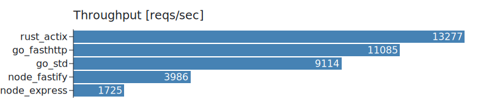
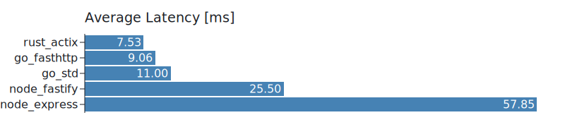
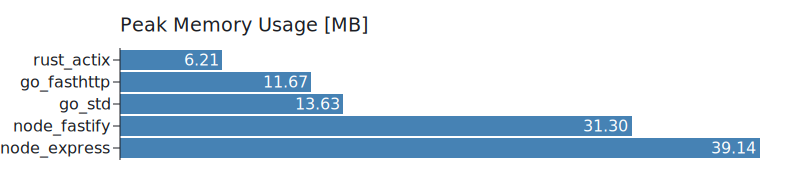

# 📊 Server Comparison

> Minimalistic web-server benchmarks with an emphasis on capturing real-world usage characteristics.

## Test Case

Every server implementation must solve the following task on each request:

1. Read the `test_data.json` file from the file system.
1. Deserialize the `JSON` file to a language-specific data structure (eg.: object, struct etc...).
1. Take the `token` field and verify the `JWT` using the `secret`.
1. Deserialize the JWT payload into a language-specific data structure.
1. Respond with the deserialized payload in the form of a `JSON` body.

## Results

The server under test was running on the cheapest DigitalOcean VM, with **1 vCPU** and **1GB** of RAM.
The benchmark was powered by [wrk](https://github.com/wg/wrk), with the following parameters:

- Total number of HTTP connections to keep open: **100** 
- Total number of threads to use: **2**
- Duration of the test: **15s**

